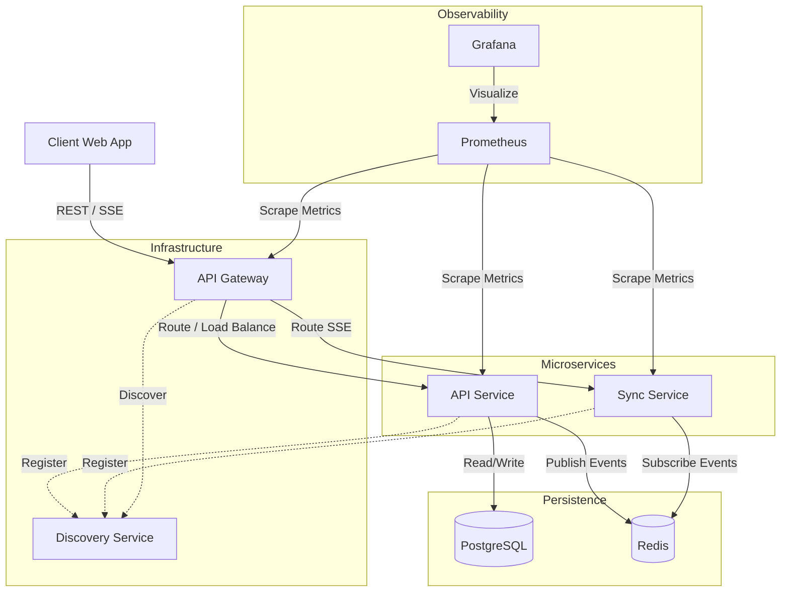
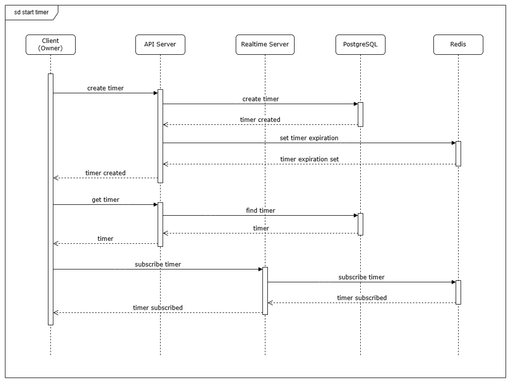
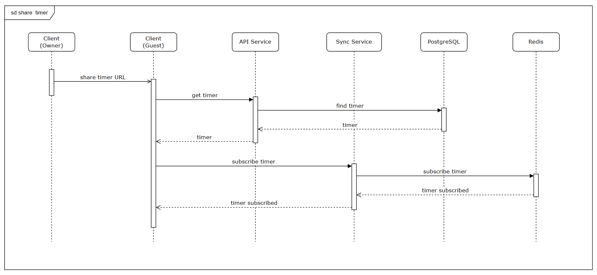
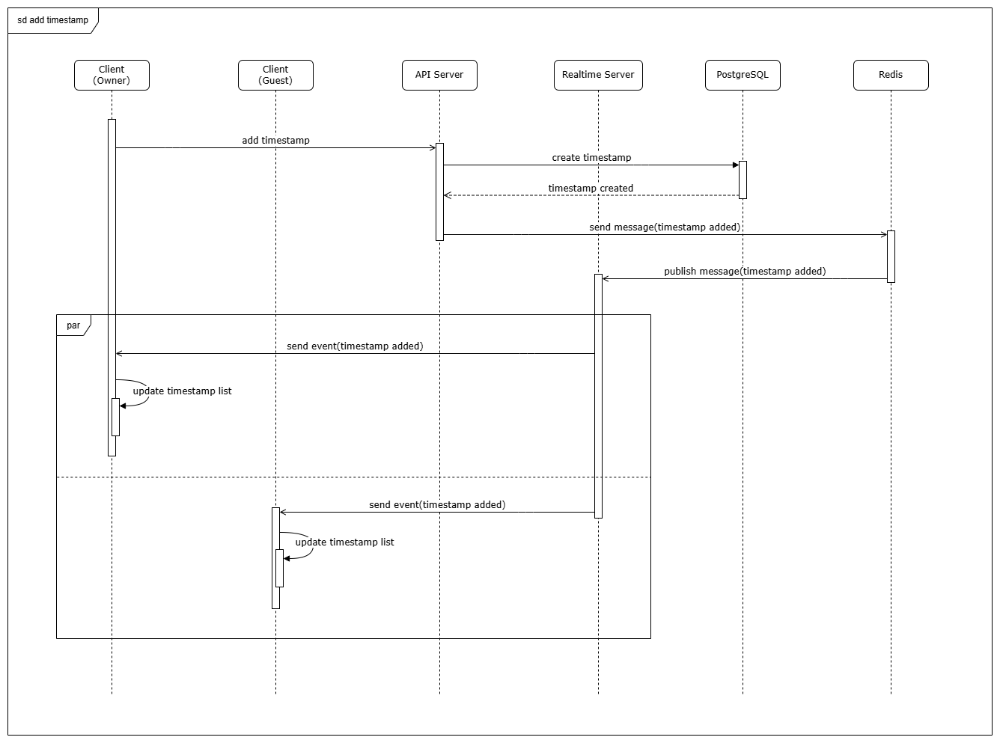
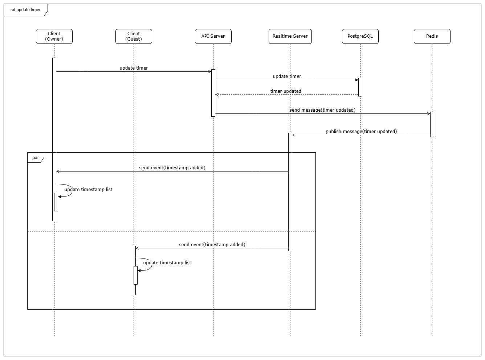
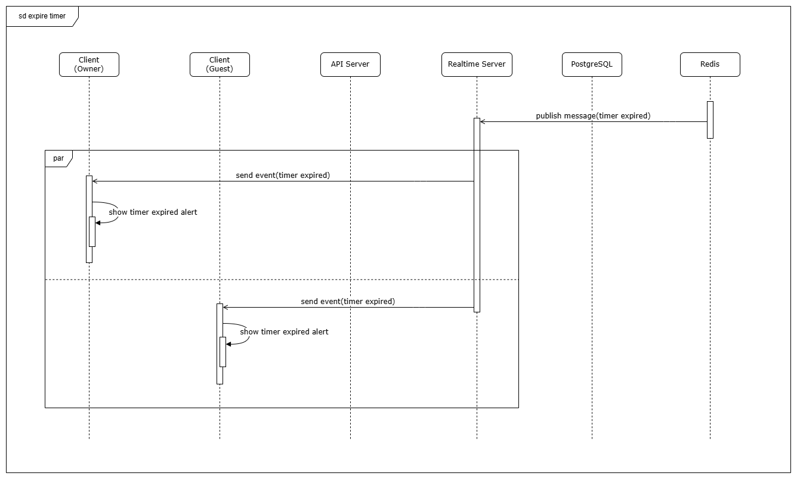

# 🕒 ShareTimer

**ShareTimer** is a web service that lets you create custom timers and share them instantly with others.  
Whether you're coordinating an online study session, managing a team sprint, or setting a countdown for an event, ShareTimer makes time management collaborative and effortless.

---

## ✨ Features

- 🧭 **Create** — Set up timers in seconds with a clean, intuitive interface.  
- 🔗 **Share** — Generate a unique link to share your timer with anyone, anywhere.  
- ⏱️ **Sync (SSE)** — All timer events (updates, timestamp additions, and expirations) are synchronized to connected clients using Server‑Sent Events (SSE).
- 💻 **Flexible** — Works on any device, no login required.

---

## ⚙️ Architecture Overview

The ShareTimer system is composed of the following main components:
- **Client (Owner / Guest)** — Front-end web application. Opens an SSE stream for real‑time events and sends REST requests to manage timers.
- **API Service** — Core business logic service. Provides REST endpoints for creating, updating, and retrieving timers and timestamps.
- **Sync Service (SSE Gateway)** — Real-time event handler. Exposes SSE endpoints for client subscriptions, delivers ordered events, and bridges internal pub/sub messages.
- **API Gateway** — Unified entry point. Built with Spring Cloud Gateway, it routes traffic to backend services and handles cross-cutting concerns.
- **Discovery Service** — Service registry based on Netflix Eureka. Enables dynamic registration and discovery, allowing services to communicate without hardcoded URLs.
- **PostgreSQL** — Durable relational database. Stores persistent data including timer configurations and timestamp history.
- **Redis** — In-memory data store. Manages TTL-based expiration and acts as a pub/sub message broker for real-time synchronization.
- **Prometheus** — Monitoring and metrics collection. Tracks service performance and provides visibility into system health.
- **Grafana** — Visualization tool. Displays metrics and provides a user-friendly interface for monitoring system performance.



---

## 💡 How to Run
### 🚀 Using Docker Compose
To start the service with Docker, simply run the following command from the project root directory, where the compose.yaml file is located:
```
docker compose up -d
```

### 🌐 Access the Web Interface
Once the containers are running, open your browser and navigate to:
- http://localhost:8080/

### 📘 API Documentation
#### API Service Documentation
Access the main API Service’s Swagger documentation at:
- http://localhost:8080/api/v1/swagger-ui/index.html

#### Sync Service Documentation
View the Sync Service’s Swagger documentation here:
- http://localhost:8080/sync/v1/swagger-ui/index.html

### 🔭Monitoring
Access the Eureka dashboard at:
- http://localhost:8761/

Access the Prometheus dashboard at:
- http://localhost:9090/targets

Access the Grafana dashboard at:
- http://localhost:3000/

---

## 🔀 Sequence Diagrams

### Creating a Timer

The user configures a timer and sends a creation request to the API Service.
The server validates the input, stores the timer in PostgreSQL, and returns a unique shareable Id.



### Joining a Shared Timer

Another user accesses the timer through its shared link.
The Client retrieves timer details via the API Service and displays the synchronized countdown UI.



### Real-Time Synchronization

Clients connect to the Sync Service via SSE.
When the owner adds a timestamp or changes the timer, the API Service updates the database and uses Redis to alert the Sync Service.
All linked clients are instantly informed of any changes to the timer's status, guaranteeing shared real-time consistency.




### Timer Expiration & Notification

When the countdown reaches zero, Redis triggers an expiration event.
Every client modifies their UI in response to a timer-expired event published by the Sync Service.


