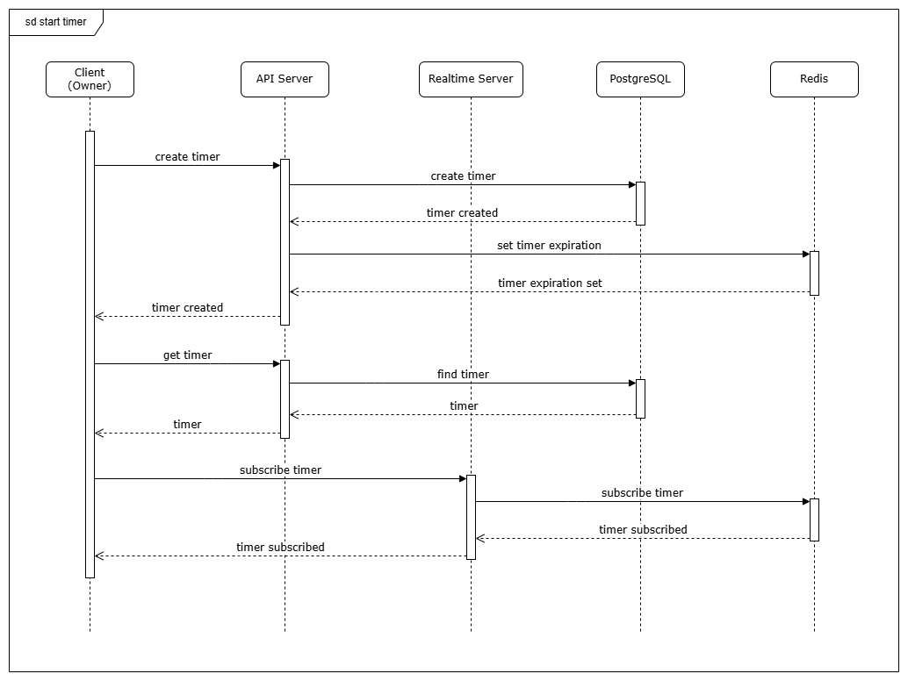
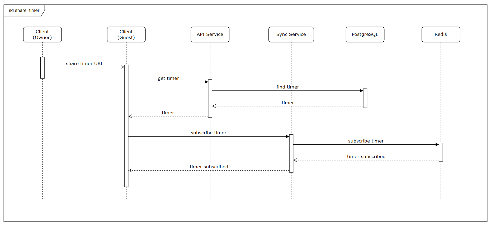
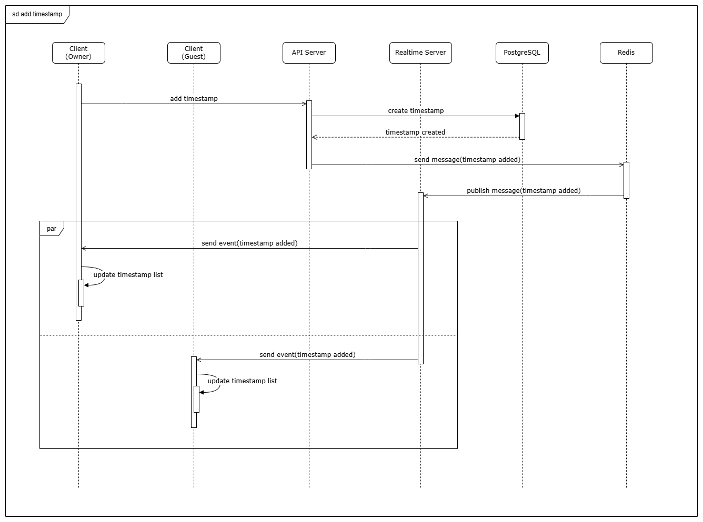
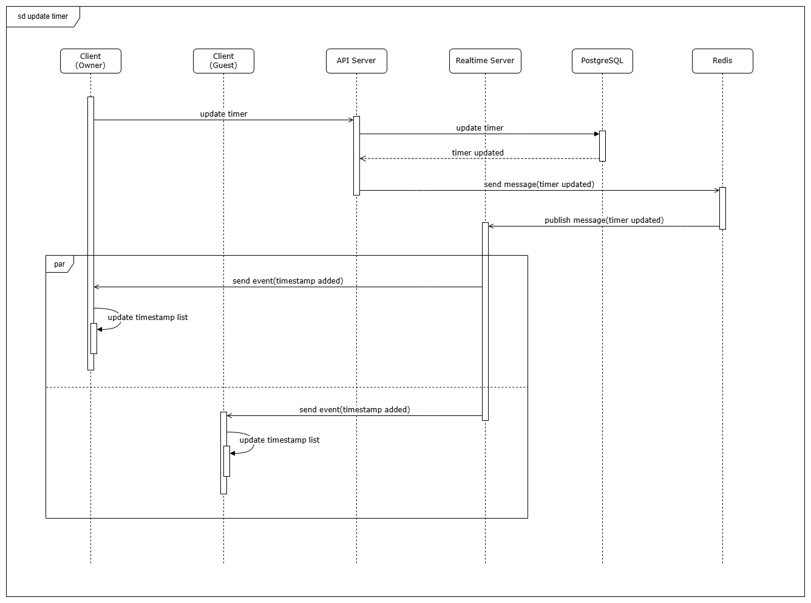
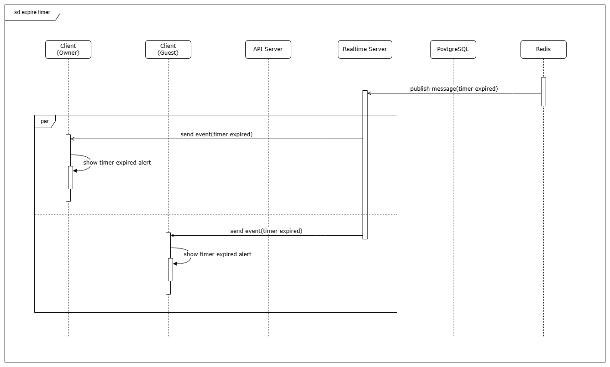

# 🕒 ShareTimer

**ShareTimer** is a web service that lets you create custom timers and share them instantly with others.  
Whether you're coordinating an online study session, managing a team sprint, or setting a countdown for an event, ShareTimer makes time management collaborative and effortless.

---

## ✨ Features

- 🧭 **Create** — Set up timers in seconds with a clean, intuitive interface.  
- 🔗 **Share** — Generate a unique link to share your timer with anyone, anywhere.  
- ⏱️ **Sync (SSE)** — All timer events (updates, timestamp additions, and expirations) are synchronized to connected clients using Server‑Sent Events (SSE).
- 💻 **Flexible** — Works on any device, no login required.

---

## ⚙️ Architecture Overview

The ShareTimer system is composed of the following main components:
- **Client (Owner / Guest)** — Browser web UI. Opens an SSE stream to receive real‑time events; sends REST requests to modify timers.
- **API Service** — HTTP REST endpoints for creating timers, adding timestamps, updating timers, and finding timers.
- **Sync Service (SSE gateway)** — Exposes SSE endpoints for clients to subscribe to timer channels. Delivers ordered events, supports reconnection with `Heartbeat`, and acts as the pub/sub bridge.
- **API Gateway** — Act as the single entry point for all client requests. implemented with Spring Cloud Gateway, it routes traffic to the backend services (API Service, Sync Service) and handles cross-cutting concerns.
- **Discovery Service** — Service registry server based on Netflix Eureka. It enables dynamic service registration and discovery, allowing microservices to locate each other without hardcoded URLs.
- **PostgreSQL** — Durable storage for timer records and timestamp history.
- **Redis** — Handles TTL-based expiration, pub/sub for notifying the Sync Service of events.

---

## 💡 How to Run
### 🚀 Using Docker Compose
To start the service with Docker, simply run the following command from the project root directory, where the compose.yaml file is located:
```
docker compose up -d
```

### 🌐 Access the Web Interface
Once the containers are running, open your browser and navigate to:
- **Web Client**: http://localhost:3000/

### 📘 API Documentation
#### API Service Documentation
Access the main API server’s Swagger documentation at:
- http://localhost:5000/api/v1/swagger-ui/index.html

#### Sync Service Documentation
View the realtime event server’s Swagger documentation here:
- http://localhost:5500/event/v1/swagger-ui/index.html

---

## 🔀 Sequence Diagrams

### Creating a Timer

The user configures a timer and sends a creation request to the API Service.
The server validates the input, stores the timer in PostgreSQL, and returns a unique shareable Id.



### Joining a Shared Timer

Another user accesses the timer through its shared link.
The Client retrieves timer details via the API Service and displays the synchronized countdown UI.



### Real-Time Synchronization

Clients connect to the Sync Service via SSE.
When the owner adds a timestamp or changes the timer, the API Service updates the database and uses Redis to alert the Sync Service.
All linked clients are instantly informed of any changes to the timer's status, guaranteeing shared real-time consistency.




### Timer Expiration & Notification

When the countdown reaches zero, Redis triggers an expiration event.
Every client modifies their UI in response to a timer-expired event published by the Sync Service.

